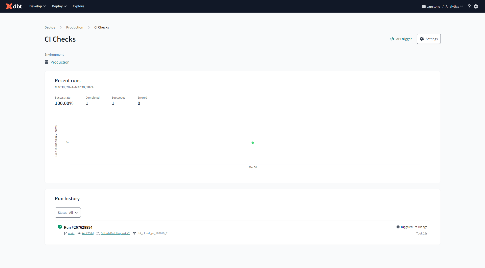
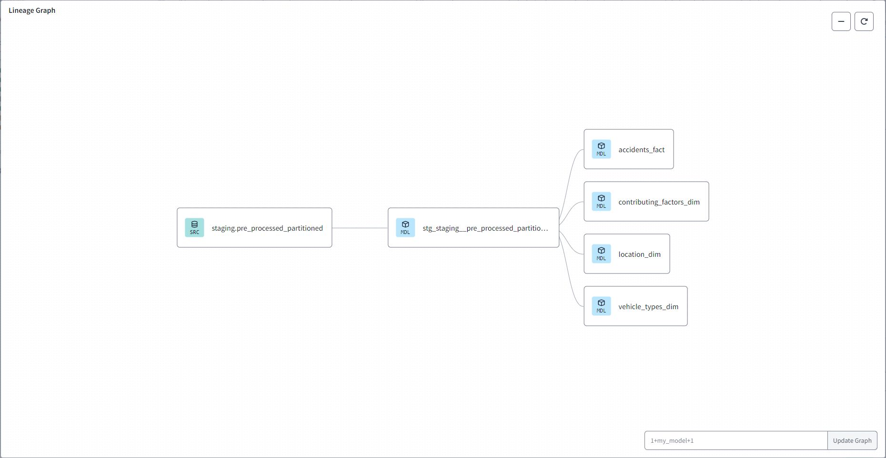

# Motor-Vehicles-Collision-Data-Analysis-NewYork
### Identifying High-Risk Areas based on accident data.

## Workflow/Architecture

## Project about 
It's course project at data-engineering-zoomcamp by [DataTalksClub](https://github.com/DataTalksClub/data-engineering-zoomcamp).

## Problem: Identifying High-Risk Areas
For this project I've tried to build a batch pipeline to process motor vehicle collisions data in New York from (`https://catalog.data.gov/`,An official website of the GSA's Technology Transformation Services).The Motor Vehicle Collisions crash table contains details on the crash event. Each row represents a crash event. The Motor Vehicle Collisions data tables contain information from all police reported motor vehicle collisions/accidents in NYC. 
Accidents can occur more frequently in certain neighborhoods or zip codes. Identifying these high-risk areas is crucial for improving safety measures, allocating resources effectively, and preventing accidents. **We want to pinpoint the locations where accidents are most likely to happen.**

## Dataset
[Motor Vehicle Collisions crash dataset website](https://catalog.data.gov/dataset/motor-vehicle-collisions-crashes/resource/b5a431d2-4832-43a6-9334-86b62bdb033f)

[Motor Vehicle Collisions crash dataset direct link](https://data.cityofnewyork.us/api/views/h9gi-nx95/rows.csv?accessType=DOWNLOAD)

## Technologies
- **Google cloud platform** (GCP):
  - VM Instance to run project on it.
  - Cloud Storage to store processed data.
  - BigQuery as data source for dashboard.
- **Terraform** to create cloud infrastructure.
- **Docker** for containerization (docker-compose)
- **Python** main programming language
- **Airflow** to run data pipelines as DAGs.
- **Spark** to pre-process raw data.
- **dbt** to perform transformations. 
- **Google data studio** to visualize data.

# Reproducing from scratch
## 1. To reproduce this code entirely from scratch, you will need to create a GCP account:
Set up your free GCP account! You'll get free $300 credit or 90 days of free usage.
**Project was build on GCP Debian VM Instance, so you can find code snippets for these particular case [here](https://github.com/adityachaudhary99/Motor-Vehicles-Collision-Data-Analysis-NewYork/blob/main/pre-reqs.md).**

* Set up your  very own [service account](https://cloud.google.com/)
* Create key in JSON
* Save to your directory
* download and install [Google Cloud CLI](https://cloud.google.com/sdk/docs/install)
* run `export GOOGLE_APPLICATION_CREDENTIALS=<path/to/service/key>.json`
* run `gcloud auth application-default login`
* new browser window will pop up having you authenticate the gcloud CLI. Make sure it says `You are now authenticated with the gcloud CLI!`

## Next for GCP: Add permissions to your Service Account!
* IAM & Admin > IAM. Click on the edit icon for your project
* Add roles
    * Storage Admin (for the bucket)
    * Storage Object Admin (for objects in the bucket -- read/write/create/delete)
    * BigQuery Admin
* Enable APIs
    * https://console.cloud.google.com/apis/library/iam.googleapis.com
    * https://console.cloud.google.com/apis/library/iamcredentials.googleapis.com

## 2. You'll need your IaC to build your infrastructure. In this project, Terraform is used
Download Terraform!
* Download here: https://www.terraform.io/downloads

Initializing Terraform
* Create a new directory with `main.tf`, and initialize your config file. [How to Start](https://learn.hashicorp.com/tutorials/terraform/google-cloud-platform-build?in=terraform/gcp-get-started)
    * *OPTIONAL* Create `variables.tf` files to store your variables
* `terraform init`
* `terraform plan`
* `terraform apply`

## 3. Set up Docker, Dockerfile, and docker-compose to run Airflow
To set up airflow, you can refer to this [link](https://github.com/DataTalksClub/data-engineering-zoomcamp/tree/main/cohorts/2022/week_2_data_ingestion/airflow)

#### Data pipelines
The dataset data download, process and upload to cloud storage, transfer to data warehouse is done via these Airflow DAGs:

**Local to GCS Dag** 
  - Runs once since there is a single dataset, can be changed accordingly though. 
  - Downloads the dataset file in the csv format. This task runs by a bash script, which downloads the data. 
  - Next the data is pre-processed using pyspark(changing column names, data types, etc) and saves it locally in the form of parquet file. 
  - This file is then uploaded to project Cloud Storage(Data Lake).
  - Last task triggers the <code>gcs_to_bq_dag</code> so that it runs right after the data has been loaded to project Cloud Storage.

 **GCS to BQ Dag**
  - The dag transfers the data in parquet files in the project Cloud Storage to the project BigQuery dataset made earlier using terraform.
  - Followed by creation of a partitioned and clustered table at project BigQuery dataset.
  - Lastly local clean up is done to erase the data from the local system.

## 4. Run the DAGs
* run the `local_to_gcs_dag` first and wait for it to complete. 
* The last task in the `local_to_gcs_dag` will trigger the `gcs_to_bq_dag` and it will run shortly.

## 5. dbt cloud setup and environment
For setting up the dbt cloud environment you can refer to [here](https://github.com/DataTalksClub/data-engineering-zoomcamp/blob/main/04-analytics-engineering/dbt_cloud_setup.md).

Some screenshots from dbt cloud setup for the project-
#### Production Environment - 

#### Scheduled pipeline to fetch fresh data from sources everyday -  

#### Continuation Integration Pipeline -

#### dbt models lineage Graph

### 6. Create your dashboard
* Go to [Google Data Studio](https://datastudio.google.com) 
* Click `Create` > `Data Source`
* Select `BigQuery` > Your Project ID > Dataset > Table
* Click on `Connect` on the top-right and your data should now be imported to use for your dashboard!

#### Dashboard
Simple dashboard at Google Data studio with few graphs.
- Accident Heatmap by Borough.
- Time-of-Day​ Accident Distribution.​
- Contributing Factors Pie Chart​.
- Top 10 Riskiest Neighborhoods.

Below is a screenshot of my [dashboard](https://lookerstudio.google.com/reporting/c86f75eb-00f6-4b0f-8175-3f9ebd2e65df).

Thanks to the DataTalksClub for the oppurtunity! If you have any questions, please feel free to open a PR or send me an email.
